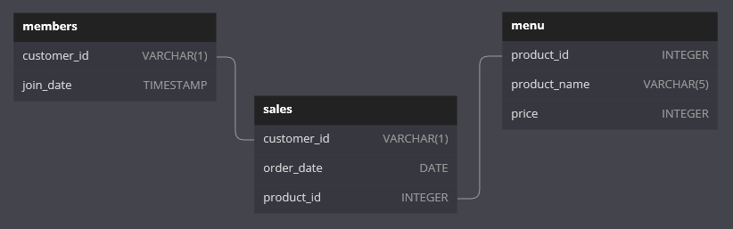

# Case Study 1 - Danny's Diner

## ER Diagram 


*Diagram adapted from [case study webpage](https://8weeksqlchallenge.com/case-study-1/)*

## 1. What is the total amount each customer spent at the restaurant?

- The `sales` table contains records on every item purchased by each customer
- Join to the `menu` table to obtain every item's `price`
- Add up the item `price`s for each customer using `GROUP BY`

``` sql
SELECT 
    sales.customer_id AS customer,
    SUM(price) AS spending_total
FROM sales
INNER JOIN menu 
    ON sales.product_id = menu.product_id
GROUP BY sales.customer_id
ORDER BY sales.customer_id;
```

| customer | spending_total |
| -------- | -------------- |
| A        | 76             |
| B        | 74             |
| C        | 36             |

---

## 2. How many days has each customer visited the restaurant?

- Customers may have purchased more than one item in a single day
- `COUNT DISTINCT` counts multiple records on the same day only once
- Use `GROUP BY` to count for each customer

``` sql
SELECT 
    customer_id AS customer,
    COUNT(DISTINCT order_date) AS days_visited
FROM sales
GROUP BY customer_id
ORDER BY customer_id;
```

| customer | days_visited |
| -------- | ------------ |
| A        | 4            |
| B        | 6            |
| C        | 2            |

---

## 3. What was the first item from the menu purchased by each customer?

- `RANK` the purchase order of every item for each customer 
- In the case of a tie, all items are included
- `SELECT DISTINCT` removes duplicates if a customer purchased multiples of the same item during their first purchase

``` sql
WITH ordered_sales AS (
    SELECT 
        customer_id,
        order_date,
        product_id,
        RANK() OVER(
            PARTITION BY customer_id 
            ORDER BY order_date) AS purchase_order
    FROM sales
)
SELECT DISTINCT 
    os.customer_id AS customer,
    menu.product_name AS first_purchase
FROM ordered_sales AS os
INNER JOIN menu
	ON os.product_id = menu.product_id
WHERE purchase_order = 1
ORDER BY os.customer_id;
```

|customer|first_purchase|
|--------|--------------|
|A       |curry         |
|A       |sushi         |
|B       |curry         |
|C       |ramen         |

---

## 4. What is the most purchased item on the menu and how many times was it purchased by all customers?

- Count the number of records in `sales` per product
- Sort the number of purchases in descending order and `LIMIT` to the first result

``` sql
SELECT 
    menu.product_name AS product,
    COUNT(sales.product_id) AS purchases
FROM sales
INNER JOIN menu
    ON sales.product_id = menu.product_id
GROUP BY menu.product_name
ORDER BY purchases DESC
LIMIT 1;
```

|product|purchases|
|-------|---------|
|ramen  |8        |

---

## 5. Which item was the most popular for each customer?

- Rank the number of purchases of each item for each customer
- In the case of a tie, all items are included, and sorted in alphabetical order

``` sql
-- count purchases of items for each customer
-- rank number of purchases in descending order
WITH item_popularity AS (
    SELECT 
        sales.customer_id,
        menu.product_name,
        COUNT(sales.product_id) AS purchases,
        RANK() OVER(
            PARTITION BY customer_id
            ORDER BY COUNT(sales.product_id) DESC
        ) AS popular_rank
    FROM sales
    INNER JOIN menu
        ON sales.product_id = menu.product_id
    GROUP BY 
        sales.customer_id, 
        menu.product_name
)
SELECT 
    customer_id AS customer,
    product_name AS most_popular_item,
    purchases
FROM item_popularity
WHERE popular_rank = 1
ORDER BY 
    customer, 
    most_popular_item;
```

| customer | most_popular_item | purchases |
| -------- | ----------------- | --------- |
| A        | ramen             | 3         |
| B        | curry             | 2         |
| B        | ramen             | 2         |
| B        | sushi             | 2         |
| C        | ramen             | 3         |

---

## 6. Which item was purchased first by the customer after they became a member?

- Join `sales` to `members` and filter sales based on membership and `join_date`
- Rank the purchase order of every item for each member
- Obtain the first item purchased for each member
- In case of a tie, include all items in alphabetical order

``` sql
-- filter sales for members 
-- rank order of purchase by date
WITH members_sales AS (
    SELECT 
        sales.customer_id,
        sales.order_date,
        sales.product_id,
        RANK() OVER(
            PARTITION BY sales.customer_id 
            ORDER BY sales.order_date) AS purchase_order
    FROM sales
    INNER JOIN members
        ON sales.customer_id = members.customer_id
    WHERE sales.order_date >= members.join_date
)
SELECT 
    ms.customer_id,
    menu.product_name
FROM members_sales AS ms
INNER JOIN menu
	ON ms.product_id = menu.product_id
WHERE purchase_order = 1;
```

| customer | first_purchase |
| -------- | -------------- |
| A        | curry          |
| B        | sushi          |

---

## 7. Which item was purchased just before the customer became a member?

- Join `sales` to `members` and filter sales for customers before they became members
- Rank the purchase order of items for each member in reverse order (latest first)
- Obtain the latest item purchased for each member
- In case of a tie, include all items in alphabetical order

``` sql
-- filter sales for customers before they became members
-- rank order of purchase by date in reverse
WITH before_member_sales AS (
    SELECT 
        sales.customer_id,
        sales.order_date,
        sales.product_id,
        RANK() OVER(
            PARTITION BY sales.customer_id 
            ORDER BY sales.order_date DESC) AS rev_purchase_order
    FROM sales
    INNER JOIN members
        ON sales.customer_id = members.customer_id
    WHERE sales.order_date < members.join_date
)
-- retrieve the last item(s) ordered before customer becomes a member
SELECT 
    bms.customer_id AS customer,
    menu.product_name AS last_purchase_before_member
FROM before_member_sales AS bms
INNER JOIN menu
    ON bms.product_id = menu.product_id
WHERE rev_purchase_order = 1
ORDER BY 
    customer, 
    last_purchase_before_member;
``` 

|customer|last_purchase_before_member|
|--------|---------------------------|
|A       |curry                      |
|A       |sushi                      |
|B       |sushi                      |

---

## 8. What is the total items and amount spent for each member before they became a member?

- Join `sales` to `members` and filter sales for customers before they became members
- Join this table to `menu` to obtain item prices and calculate total amount spend for each customer

``` sql
-- filter sales for customers before become members
WITH before_member_sales AS (
    SELECT 
        sales.customer_id,
        sales.order_date,
        sales.product_id,
    FROM sales
    INNER JOIN members
        ON sales.customer_id = members.customer_id
    WHERE sales.order_date < members.join_date
)
SELECT 
    bms.customer_id AS customer,
    COUNT(bms.product_id) AS orders_num,
    SUM(menu.price) AS spending_total
FROM before_member_sales AS bms
INNER JOIN menu
    ON bms.product_id = menu.product_id
GROUP BY bms.customer_id
ORDER BY bms.customer_id;
```

|customer|orders_num|spending_total|
|--------|----------|--------------|
|A       |2         |25            |
|B       |3         |40            |

---

## 9.  If each $1 spent equates to 10 points and sushi has a 2x points multiplier - how many points would each customer have?

- Calculate the points awarded for each item purchased, based on the price (20 points for sushi, 10 points for others)
- Tally the points earned by each customer based on their orders

``` sql
-- compute points per sale based on item price
-- 2x points for sushi
WITH order_points AS (
    SELECT 
        sales.customer_id,
        CASE 
            WHEN menu.product_name = 'sushi' THEN 20 * menu.price
            ELSE 10 * menu.price 
        END AS points
    FROM sales
    INNER JOIN menu
        ON sales.product_id = menu.product_id
)
-- tally points for each customer
SELECT 
    customer_id AS customer,
    SUM(points) AS points_total
FROM order_points
GROUP BY customer_id
ORDER BY customer_id;
```

|customer|points_total|
|--------|------------|
|A       |860         |
|B       |940         |
|C       |360         |

---

## 10. In the first week after a customer joins the program (including their join date) they earn 2x points on all items, not just sushi - how many points do customer A and B have at the end of January?

- Calculate the points awarded for each item purchased (10 points per dollar)
- Include 2x points for sushi, or all items in the first week of membership (starting from and including the `join_date`)
- Tally the points earned by each customer as of 31st January

``` sql
-- compute points per sale based on item price
-- 2x points for all items in the 1st week of membership
-- 2x points for sushi (does not stack with 1st week of membership)
WITH member_order_points AS (
    SELECT 
        sales.customer_id,
        sales.order_date,
        members.join_date,
        menu.product_name,
        menu.price,
        CASE 
            WHEN sales.order_date 
                BETWEEN members.join_date
                AND members.join_date + 6 THEN 20 * menu.price
            WHEN menu.product_name = 'sushi' THEN 20 * menu.price
            ELSE 10 * menu.price 
        END AS points
    FROM sales
    INNER JOIN menu
        ON sales.product_id = menu.product_id
    INNER JOIN members
        ON sales.customer_id = members.customer_id
)
-- tally points for each member
SELECT 
    customer_id AS customer,
    SUM(points) AS points_total
FROM member_order_points
WHERE order_date <= '2021-01-31'
GROUP BY customer_id
ORDER BY customer_id;
```

|customer|points_total|
|--------|------------|
|A       |1370        |
|B       |820         |

## Bonus 

The objective of the bonus questions is to write queries that recreate data tables in a specific format as given on the case study webpage. The outputs of the queries are also printed below for reference.

### 1 - Join All the Things!

```sql
SELECT
    sales.customer_id,
    sales.order_date,
    menu.product_name,
    menu.price,
    CASE 
        WHEN members.customer_id IS NOT NULL
        AND sales.order_date >= members.join_date THEN 'Y'
        ELSE 'N' 
    END AS member
FROM sales
INNER JOIN menu
    ON sales.product_id = menu.product_id
LEFT JOIN members
    ON sales.customer_id = members.customer_id
ORDER BY 
    sales.customer_id,
    sales.order_date,
    menu.product_name;
```

|customer_id|order_date|product_name|price|member|
|-----------|----------|------------|-----|------|
|A|2021-01-01|curry|15|N|
|A|2021-01-01|sushi|10|N|
|A|2021-01-07|curry|15|Y|
|A|2021-01-10|ramen|12|Y|
|A|2021-01-11|ramen|12|Y|
|A|2021-01-11|ramen|12|Y|
|B|2021-01-01|curry|15|N|
|B|2021-01-02|curry|15|N|
|B|2021-01-04|sushi|10|N|
|B|2021-01-11|sushi|10|Y|
|B|2021-01-16|ramen|12|Y|
|B|2021-02-01|ramen|12|Y|
|C|2021-01-01|ramen|12|N|
|C|2021-01-01|ramen|12|N|
|C|2021-01-07|ramen|12|N|


### 2 - Rank All The Things!

A `ranking` is added for members' orders based on when they were made (earliest first). The `ranking` should be NULL (blank) for orders made by non-members (including orders by customers before they became members).

```sql
WITH joined_data AS (
    SELECT
        sales.customer_id,
        sales.order_date,
        menu.product_name,
        menu.price,
        CASE 
            WHEN members.customer_id IS NOT NULL
            AND sales.order_date >= members.join_date THEN 'Y'
        ELSE 'N' END AS member
    FROM sales
    INNER JOIN menu
        ON sales.product_id = menu.product_id
    LEFT JOIN members
        ON sales.customer_id = members.customer_id
)
SELECT
    customer_id,
    order_date,
    product_name,
    price,
    member,
    CASE 
        WHEN member = 'Y' THEN
            DENSE_RANK() OVER(
                PARTITION BY customer_id, member 
                ORDER BY order_date)
        ELSE null 
    END AS ranking
FROM joined_data
ORDER BY 
    customer_id, 
    order_date;
```
|customer_id|order_date|product_name|price|member|ranking|
|-----------|----------|------------|-----|------|-------|
|A|2021-01-01|sushi|10|N||
|A|2021-01-01|curry|15|N||
|A|2021-01-07|curry|15|Y|1|
|A|2021-01-10|ramen|12|Y|2|
|A|2021-01-11|ramen|12|Y|3|
|A|2021-01-11|ramen|12|Y|3|
|B|2021-01-01|curry|15|N||
|B|2021-01-02|curry|15|N||
|B|2021-01-04|sushi|10|N||
|B|2021-01-11|sushi|10|Y|1|
|B|2021-01-16|ramen|12|Y|2|
|B|2021-02-01|ramen|12|Y|3|
|C|2021-01-01|ramen|12|N||
|C|2021-01-01|ramen|12|N||
|C|2021-01-07|ramen|12|N||

