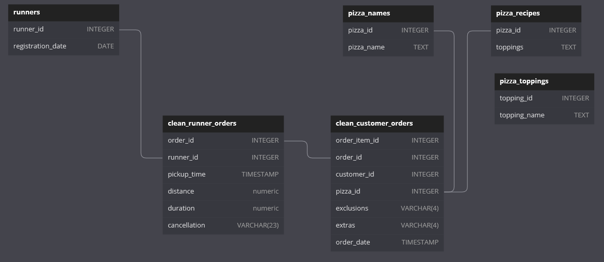

# Case Study 2-A: [Pizza Runner](https://8weeksqlchallenge.com/case-study-2/) - Pizza Metrics

Pizza Runner has collected some data and would like to know more about the customers and their pizza preferences, such as the type of pizzas ordered and the number of pizzas in each order.

### ER Diagram 



*Diagram adapted from [case study webpage](https://8weeksqlchallenge.com/case-study-2/), after data has been pre-processed.*

## Overview of Customers' Orders

### Q1. How many pizzas were ordered?

- Level of granularity in `customer_orders` is one pizza 
- Number of pizzas ordered is the number of rows in this table

|pizzas_ordered|
|--------------|
|14            |

```sql
SELECT
    COUNT(order_item_id) AS pizzas_ordered
FROM clean_customer_orders;
```

### Q2. How many unique customer orders were made?

- `order_id` is not unique in `customer_orders` as one order may contain multiple pizzas
- Use `COUNT` with `DISTINCT` for  `order_id`

|orders_made|
|-----------|
|10         |

```sql
SELECT
    COUNT(DISTINCT order_id) AS orders_made
FROM clean_customer_orders;
```

### Q3. How many successful orders were delivered by each runner?

- Assume that successful orders have a `pickup_time` recorded
- Exclude unsuccessful orders with `NULL` values for `pickup_time`

|runner_id|orders_delivered|
|---------|----------------|
|1        |4               |
|2        |3               |
|3        |1               |

```sql
SELECT
    runner_id,
    COUNT(order_id) AS orders_delivered
FROM clean_runner_orders
WHERE pickup_time IS NOT NULL
GROUP BY runner_id
```
---
## Pizza Types and Quantities

### Q4. How many of each type of pizza was delivered?

- Join `customer_orders` to `runner_orders` to filter out pizzas that were not delivered
- Then join to `pizza_names` to retrieve the names of the pizza based on the `pizza_id`.

|pizza_name|pizzas_ordered|
|----------|--------------|
|Meatlovers|9             |
|Vegetarian|3             |

```sql
SELECT
    pizza_names.pizza_name,
    COUNT(co.order_item_id) AS pizzas_ordered
FROM clean_customer_orders AS co
INNER JOIN clean_runner_orders AS ro
    ON co.order_id = ro.order_id
INNER JOIN pizza_runner.pizza_names
    ON co.pizza_id = pizza_names.pizza_id
WHERE ro.pickup_time IS NOT NULL -- filter out pizzas that are not delivered
GROUP BY pizza_name
ORDER BY pizza_name;
```

### Q5. How many Vegetarian and Meatlovers were ordered by each customer?

- Includes pizzas that were ordered but not delivered due to the order being cancelled.

|customer_id|pizza_name|pizzas_ordered|
|-----------|----------|--------------|
|101        |Meatlovers|2             |
|101        |Vegetarian|1             |
|102        |Meatlovers|2             |
|102        |Vegetarian|1             |
|103        |Meatlovers|3             |
|103        |Vegetarian|1             |
|104        |Meatlovers|3             |
|105        |Vegetarian|1             |

```sql
SELECT
    co.customer_id,
    pz.pizza_name,
    COUNT(co.order_item_id) AS pizzas_ordered
FROM clean_customer_orders AS co
INNER JOIN pizza_runner.pizza_names AS pz
    ON co.pizza_id = pz.pizza_id
GROUP BY co.customer_id, pz.pizza_name
ORDER BY co.customer_id, pz.pizza_name;
```

### Q6. What was the maximum number of pizzas delivered in a single order?

- Count the number of pizzas for each successful order within a CTE, 
- Use a subquery in the `WHERE` clause to return the order(s) with the most pizzas delivered.

|order_id|pizzas_delivered|
|--------|----------------|
|4       |3               |

```sql
WITH delivery_counts AS (
    SELECT
        co.order_id,
        COUNT(co.order_item_id) AS pizzas_delivered
    FROM clean_customer_orders AS co
    INNER JOIN clean_runner_orders AS ro
        ON co.order_id = ro.order_id
    WHERE ro.distance_km IS NOT NULL -- filter out pizzas that are not delivered
    GROUP BY co.order_id
)
SELECT
    order_id,
    pizzas_delivered
FROM delivery_counts
WHERE pizzas_delivered = 
    (SELECT MAX(pizzas_delivered) FROM delivery_counts);
```
---
## Pizzas with Extras/Exclusions

### Q7. For each customer, how many delivered pizzas had at least 1 change and how many had no changes?

- Create a new column `with_changes`
- that returns `No` when there are neither extras nor exclusions, and `Yes` if there are any extras or exclusion.

|customer_id|with_changes|pizzas_delivered|
|-----------|------------|----------------|
|101        |No          |2               |
|102        |No          |3               |
|103        |Yes         |3               |
|104        |Yes         |2               |
|104        |No          |1               |
|105        |Yes         |1               |

```sql
WITH pizza_changes AS (
    SELECT
        co.customer_id,
        CASE
            WHEN co.extras = '' 
            AND co.exclusions = '' THEN 'No'
            ELSE 'Yes' 
        END AS with_changes
    FROM clean_customer_orders AS co
    INNER JOIN clean_runner_orders AS ro
        ON co.order_id = ro.order_id
    WHERE ro.pickup_time IS NOT NULL
)
SELECT
    customer_id,
    with_changes,
    COUNT(*) AS pizzas_delivered
FROM pizza_changes
GROUP BY 
    customer_id, 
    with_changes
ORDER BY 
    customer_id, 
    with_changes DESC;
```

### Q8. How many pizzas were delivered that had both exclusions and extras?

- Similar approach to the previous question 
- Instead `with_both_changes` checks whether a pizza had both extras and exclusions (i.e. both are not blank)

|with_both_changes|pizzas_delivered|
|-----------------|----------------|
|Yes              |1               |
|No               |11              |

```sql
WITH pizza_changes_both AS (
    SELECT
        co.*,
        CASE
            WHEN co.extras <> '' 
            AND co.exclusions <> '' THEN 'Yes'
            ELSE 'No' 
        END AS with_both_changes
    FROM clean_customer_orders AS co
    INNER JOIN clean_runner_orders AS ro
        ON co.order_id = ro.order_id
    WHERE ro.distance_km IS NOT NULL
)
SELECT
    with_both_changes,
    COUNT(*) AS pizzas_delivered
FROM pizza_changes_both
GROUP BY with_both_changes
ORDER BY with_both_changes DESC;
```
---
## Order Timings

### Q9. What was the total volume of pizzas ordered for each hour of the day?

- Use `date_part()` to extract the hour of the day
- The table excludes hours with no orders. 
- Pizzas are being ordered for lunch, dinner and late-night suppers.

|hour_of_order|pizzas_ordered|
|-------------|--------------|
|11           |1             |
|13           |3             |
|18           |3             |
|19           |1             |
|21           |3             |
|23           |3             |

```sql
SELECT
  date_part('hour', order_time) AS hour_of_order,
  COUNT(pizza_id) AS pizzas_ordered
FROM clean_customer_orders
GROUP BY date_part('hour', order_time)
ORDER BY hour_of_order;
```

### 10. What was the volume of orders for each day of the week?

- Use `to_char()` to extract the named day of week

|day_of_week|pizzas_ordered|
|-----------|--------------|
|Saturday |5|
|Wednesday|5|
|Thursday |3|
|Friday   |1|

```sql
SELECT
    to_char(order_time, 'Day') AS day_of_week,
    COUNT(pizza_id) AS pizzas_ordered
FROM clean_customer_orders
GROUP BY day_of_week
ORDER BY pizzas_ordered DESC;
```
