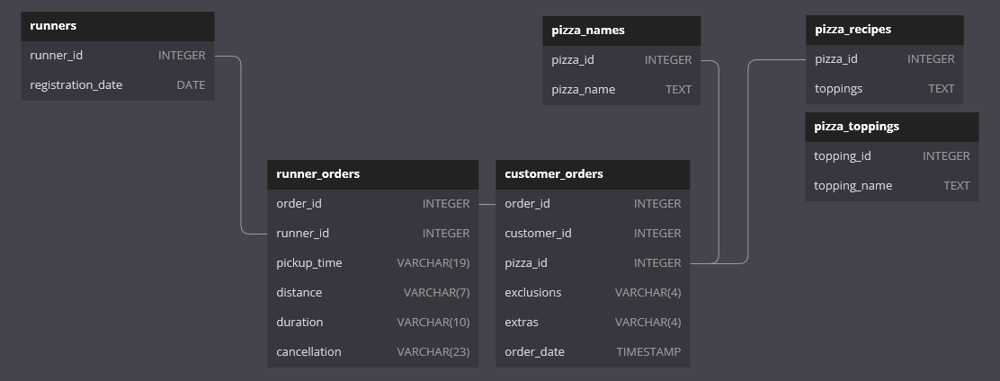

# Case Study 2-B: [Pizza Runner](https://8weeksqlchallenge.com/case-study-2/) - Runner and Customer Experience

Pizza Runner has also collected some data on their runners and orders. They want to have a better understanding of the order and delivery metrics, such as preparation times and delivery times, so that they can improve the experience for both their runners as well as their customers.

### ER Diagram 



*Diagram adapted from [case study webpage](https://8weeksqlchallenge.com/case-study-2/)*

## Overview of Runners
### Q1. How many runners signed up for each 1 week period? (i.e. week starts 2021-01-01)

- Define `2021-01-01` (a Friday) as the first day of the week
- Use modulo `%` operator to find the number of days that has passed since the start of a 1 week period, then subtract by this number to get first 1st day of that 1 week period.

|start_of_week|signups|
|-------------|-------|
|2021-01-01|2|
|2021-01-08|1|
|2021-01-15|1|

```sql
WITH runner_signups AS (
    SELECT
        runner_id,
        registration_date,
        -- modulo by 7 gives numbers of days passed since the start of week
        -- subtract by this number to get the first day of the week
        registration_date - 
        ((registration_date - '2021-01-01') % 7)  AS start_of_week
    FROM pizza_runner.runners
)
SELECT
    start_of_week,
    COUNT(runner_id) AS signups
FROM runner_signups
GROUP BY start_of_week
ORDER BY start_of_week;
```

---
## Preparation Times

### Q2. What was the average time in minutes it took for each runner to arrive at the Pizza Runner HQ to pickup the order?

- Assume that the time for the runner to arrive at Pizza Runner HQ is the interval from `order_time` to `pickup_time` 
- `date_part()` to extract the minutes from the average `time_to_pickup` for each runner

|runner_id               |avg_arrival_minutes|
|------------------------|-------------------|
|1                       |15                 |
|2                       |23                 |
|3                       |10                 |

```sql
WITH runner_pickups AS (
    SELECT
        ro.runner_id,
        ro.order_id,
        (ro.pickup_time - co.order_time) AS time_to_pickup
    FROM clean_runner_orders AS ro
    INNER JOIN clean_customer_orders AS co
        ON ro.order_id = co.order_id
)
SELECT 
    runner_id,
    date_part('minutes', AVG(time_to_pickup)) AS avg_arrival_minutes
FROM runner_pickups
GROUP BY runner_id
ORDER BY runner_id;
```

### Q3. Is there any relationship between the number of pizzas and how long the order takes to prepare?

- Count number of pizzas per order
- Assume that preparation time is the time taken from `order_time` to `pickup_time`

> Based on `pickup_time`, it seems that orders with more pizzas take more time to prepare.

|pizzas_ordered|avg_time_minutes|
|--------------|----------------|
|1             |12              |
|2             |18              |
|3             |29              |

```sql
-- number of pizzas per customer order
WITH order_quant AS (
    SELECT
        order_id,
        order_time,
        COUNT(pizza_id) AS pizzas_ordered
    FROM clean_customer_orders
    GROUP BY 
        order_id, 
        order_time
), 
-- join customer order to runner orders to match pickup times
quant_times AS (
    SELECT
        ro.order_id,
        oq.pizzas_ordered,
        (ro.pickup_time - oq.order_time) AS time_to_pickup
    FROM clean_runner_orders AS ro
    INNER JOIN order_quant AS oq
        ON ro.order_id = oq.order_id
    WHERE ro.pickup_time IS NOT NULL
)
SELECT
    pizzas_ordered,
    date_part('minutes', AVG(time_to_pickup)) AS avg_time_minutes
FROM quant_times
GROUP BY pizzas_ordered
ORDER BY pizzas_ordered;
```
---
## Delivery Analysis

### Q4. What was the average distance travelled for each runner?

- Average distance travelled is calculated per order

|runner_id|avg_distance_km|
|---------|---------------|
|1        |15.85          |
|2        |23.93          |
|3        |10.00          |

```sql
SELECT
    runner_id,
    ROUND(
        AVG(distance_km), 2
        ) AS distance_km
FROM clean_runner_orders
GROUP BY runner_id
ORDER BY runner_id;
```

### Q5. What was the difference between the longest and shortest delivery times for all orders?

|difference_mins|
|---------------|
|30             |

```sql
SELECT
    MAX(duration_mins) - MIN(duration_mins) AS difference_mins
FROM clean_runner_orders;
```

### Q6. What was the average speed for each runner for each delivery and do you notice any trend for these values?

- Possible hypothesis: number of pizzas may be related to delivery speed

> Orders shown in decreasing order of average speed.  
> While the fastest order only carried 1 pizza and the slowest order carried 3 pizzas, there is no clear trend that ordering more pizzas is assocaited with a slower delivery.

|order_id|runner_id|pizzas_ordered|distance_km|duration_mins|avg_speed|
|--------|---------|--------------|-----------|-------------|---------|
|8       |2        |1             |23.4       |15           |93.60    |
|7       |2        |1             |25         |25           |60.00    |
|10      |1        |2             |10         |10           |60.00    |
|2       |1        |1             |20         |27           |44.44    |
|3       |1        |2             |13.4       |20           |40.20    |
|5       |3        |1             |10         |15           |40.00    |
|1       |1        |1             |20         |32           |37.50    |
|4       |2        |3             |23.4       |40           |35.10    |

```sql
-- Count number of pizzas in each order
WITH order_quant AS (
    SELECT
        order_id,
        order_time,
        COUNT(pizza_id) AS pizzas_ordered
    FROM clean_customer_orders
    GROUP BY order_id, order_time
)
SELECT
    ro.order_id,
    ro.runner_id,
    oq.pizzas_ordered,
    ro.distance_km,
    ro.duration_mins,
    ROUND(60 * ro.distance_km / ro.duration_mins, 2) AS avg_speed 
FROM clean_runner_orders AS ro
INNER JOIN order_quant AS oq
    ON ro.order_id = oq.order_id
WHERE pickup_time IS NOT NULL
ORDER BY avg_speed DESC
```

### Q7. What is the successful delivery percentage for each runner?

- orders that were not successfully delivered has a `pickup_time` of `NULL`
- `COUNT()` excludes `NULL` values and is used to count successful deliveries

> A runner is assigned to each order when the order is created. "Unsuccessful" deliveries arise from the restaurant or customer cancelling the order before the pizzas are picked up for delivery. 

> There is one more runner who signed up recently but has not been assigned any orders yet, so the runner does not show up in the results.

|runner_id|total|delivered|delivery_pct|
|---------|-----|---------|------------|
|1|4|4|100.0|
|2|4|3|75.0|
|3|2|1|50.0|

```sql
SELECT
    runner_id,
    COUNT(order_id) AS total,
    COUNT(pickup_time) as delivered,
    ROUND(100 * COUNT(pickup_time) / COUNT(order_id)) AS delivery_pct
FROM clean_runner_orders
GROUP BY runner_id
ORDER BY runner_id;
```
