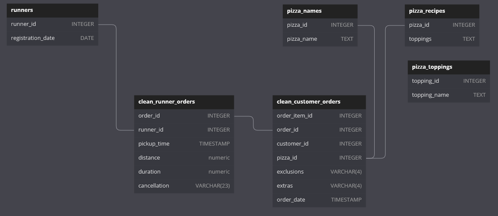

# Case Study 2-C: [Pizza Runner](https://8weeksqlchallenge.com/case-study-2/) - Ingredient Optimization

Customers may request to add extra or exclude particular toppings from the pizzas they ordered. Pizza Runner would like to know which toppings customers tend to add or exclude based on the data collected so far.

In addition, Pizza Runner also requested us to help generate order items and ingredient lists for each pizza ordered, including extras and exclusions. These would be helpful for the teams in charge of taking orders and preparing the pizzas.

### ER Diagram 



*Diagram adapted from [case study webpage](https://8weeksqlchallenge.com/case-study-2/), after data has been pre-processed.*

## Standard Pizza Toppings

Note that pizza recipes, order extras and/or exclusions may include variable numbers of toppings.The toppings are stored as comma-separated strings of `topping_id`s, each referring to a specific topping. 

|pizza_id|toppings|
|--------|--------|
|1|1, 2, 3, 4, 5, 6, 8, 10|
|2|4, 6, 7, 9, 11, 12|

We split the `topping_id`s into separate rows and store this in a temporary lookup table. This table can be joined to `pizza_toppings` to retrieve topping names.

```sql
DROP TABLE IF EXISTS recipe_topping;
CREATE TEMP TABLE recipe_topping AS(
    SELECT 
        pizza_id, 
        UNNEST(
            string_to_array(toppings, ',')
        )::int AS topping_id --cast as int for joining to other tables
    FROM pizza_recipes
)
```

### Q1. What are the standard ingredients for each pizza?

- Join the lookup table to `pizza_names` and `pizza_toppings` to get the pizza and topping names
- Use `string_agg()` to concatenate toppings for each pizza into a single string for readability

|pizza_name|standard_toppings|
|----------|-----------------|
|Meatlovers|Bacon, BBQ Sauce, Beef, Cheese, Chicken, Mushrooms, Pepperoni, Salami|
|Vegetarian|Cheese, Mushrooms, Onions, Peppers, Tomatoes, Tomato Sauce|

```sql
SELECT 
    pn.pizza_name,
    string_agg(pt.topping_name, ', ') AS standard_toppings
FROM recipe_topping AS rt
INNER JOIN pizza_names AS pn
    ON rt.pizza_id = pn.pizza_id
INNER JOIN pizza_toppings AS pt
    ON rt.topping_id = pt.topping_id
GROUP BY pn.pizza_name
ORDER BY pn.pizza_name;
```

---
## Analysis of Extra and Excluded Toppings

### Q2. What was the most commonly added extra?

- Use `string_to_array()` to split extras into separate rows
- Join extras based on `topping_id` to get their names
- Count how often each extra was added, and retrieve the most common

|extra|pizza_count|
|-----|-----------|
|Bacon|4|

```sql
WITH order_extras AS (
    SELECT 
        order_item_id,
        -- split pizzas with multiple extras into separate rows
        UNNEST(
            string_to_array(extras, ',')
        )::int AS extra_id -- cast as integer for joining
    FROM clean_customer_orders
)
-- count how often each extra was added
SELECT
    pt.topping_name AS extra,
    count(*) AS pizza_count
FROM order_extras AS ext
INNER JOIN pizza_toppings AS pt
    ON ext.extra_id = pt.topping_id
GROUP BY pt.topping_name
-- obtain most common extra
ORDER BY pizza_count DESC
LIMIT 1;
```

### Q3. What was the most common exclusion?

- Same approach as Question 2, but for `exclusions` instead of extras.

|exclusion|pizza_count|
|---------|-----------|
|Cheese|4|

```sql
WITH order_exclusions AS (
    SELECT 
        order_item_id,
        -- split pizzas with multiple exclusions into separate rows
        UNNEST(
            string_to_array(exclusions, ',')
        )::int AS exclusion_id -- cast as integer for joining
    FROM clean_customer_orders
)
-- count how often each topping was excluded
SELECT
    pt.topping_name AS exclusion,
    count(*) AS pizza_count
FROM order_exclusions AS exc
INNER JOIN pizza_toppings AS pt
    ON exc.exclusion_id = pt.topping_id
GROUP BY pt.topping_name
-- obtain most common exclusion
ORDER BY pizza_count DESC
LIMIT 1;
```

---
## Generating item lists for each pizza

### Q4. Generate an order item for each record in the `customers_orders` table in the format of one of the following:

> - Meat Lovers
> - Meat Lovers - Exclude Beef
> - Meat Lovers - Extra Bacon
> - Meat Lovers - Exclude Cheese, Bacon - Extra Mushroom, Peppers

* Approach:
  * Format is `(pizza name) - Exclude (exclusions) - Extra (extras)`
  * Exclusions
    * unnest `exclusions` for each pizza ordered `order_item_id`
    * join to `pizza_toppings` to get names
    * collapse exclusions into a comma-separated string per pizza ordered
    * format: `' - Exclude '`, followed by exclusions string
  * Extras
    * unnest `extras` for each pizza ordered `order_item_id`
    * join to `pizza_toppings` to get names
    * collapse extras into a comma-separated string per pizza ordered
    * format: `' - Extra '`, followed by extras string
  * Generating order item
    * `INNER JOIN` to pizza name based on `pizza_id`
    * `LEFT JOIN` to exclusions and extras based on `order_item_id`
    * Concatenate pizza name, exclusions and extras in that order
      * Lack of exclusions/extras are considered `NULL` and are automatically omitted

Table of orders with with order items:

|order_item_id|order_id|customer_id|order_item|
|-------------|--------|-----------|----------|
|1|1|101|Meatlovers|
|2|2|101|Meatlovers|
|3|3|102|Meatlovers|
|4|3|102|Vegetarian|
|5|4|103|Meatlovers  - Exclude Cheese|
|6|4|103|Meatlovers  - Exclude Cheese|
|7|4|103|Vegetarian  - Exclude Cheese|
|8|5|104|Meatlovers - Extra Bacon|
|9|6|101|Vegetarian|
|10|7|105|Vegetarian - Extra Bacon|
|11|8|102|Meatlovers|
|12|9|103|Meatlovers  - Exclude Cheese - Extra Bacon, Chicken|
|13|10|104|Meatlovers|
|14|10|104|Meatlovers  - Exclude BBQ Sauce, Mushrooms - Extra Bacon, Cheese|

<details>
<summary>Click to Show/Hide SQL query</summary>

```sql
-- list of extras per pizza ordered
WITH order_extras AS (
    SELECT 
        order_item_id,
        -- split pizzas with multiple extras into separate rows
        UNNEST(
            string_to_array(extras, ',')
        )::int AS extra_id -- cast as integer for joining
    FROM clean_customer_orders
), 
-- format extras per pizza ordered
order_item_extras AS (
SELECT
    ext.order_item_id,
    -- join extra toppings into one string per pizza
    '- Extra ' || string_agg(pt.topping_name, ', ') AS extras_str
FROM order_extras AS ext
INNER JOIN pizza_toppings AS pt
    ON ext.extra_id = pt.topping_id -- join to obtain topping names
GROUP BY ext.order_item_id
ORDER BY ext.order_item_id
), 
-- list of exclusions per pizza ordered
order_exclusions AS (
    SELECT 
        order_item_id,
        -- split pizzas with multiple exclusions into separate rows
        UNNEST(
            string_to_array(exclusions, ',')
        )::int AS exclusion_id -- cast as integer for joining
    FROM clean_customer_orders
), 
-- format exclusions per pizza ordered
order_item_exclusions AS (
SELECT
    exc.order_item_id,
    -- join excluded toppings into one string per pizza
    ' - Exclude ' || string_agg(pt.topping_name, ', ') AS exclusions_str
FROM order_exclusions AS exc
INNER JOIN pizza_toppings AS pt
    ON exc.exclusion_id = pt.topping_id --obtain topping names
GROUP BY exc.order_item_id
ORDER BY exc.order_item_id
)
-- generate order item as formatted string
SELECT
    co.order_item_id,
    co.order_id,
    co.customer_id,
    -- append exclusions and extras to pizza name, if any
    concat_ws(' ', 
        pn.pizza_name, exc.exclusions_str, ext.extras_str) AS order_item
FROM clean_customer_orders AS co
INNER JOIN pizza_names AS pn
    ON co.pizza_id = pn.pizza_id
-- left join to retain pizzas without exclusions or extras
LEFT JOIN order_item_exclusions AS exc
    ON co.order_item_id = exc.order_item_id
LEFT JOIN order_item_extras AS ext
    ON co.order_item_id = ext.order_item_id
ORDER BY co.order_item_id;
```
</details>
<br>

---
### Q5. Generate an alphabetically ordered comma separated ingredient list for each pizza order from the customer_orders table and add a 2x in front of any relevant ingredients

- For example: `Meat Lovers: 2xBacon, Beef, ... , Salami`

* approach:
  * gather ingredients and requests
    * tabulate standard ingredients for each pizza order
    * tabulate unnested exclusions for each pizza order
    * tabulate unnested extras for each pizza order
  * add/subtract toppings
    * columns: `order_item_id`, `topping_id`
    * `EXCEPT` to subtract exclusions
    * `UNION ALL` to add extras (additional servings of one topping)
  * count quantity of toppings per order
    * join to `pizza_toppings`
    * append `(quantity)x` 

Table of orders with ingredient lists

|order_item_id|order_id|customer_id|ingredient_list|
|-------------|--------|-----------|---------------|
|1|1|101|Meatlovers: Bacon, BBQ Sauce, Beef, Cheese, Chicken, Mushrooms, Pepperoni, Salami|
|2|2|101|Meatlovers: Bacon, BBQ Sauce, Beef, Cheese, Chicken, Mushrooms, Pepperoni, Salami|
|3|3|102|Meatlovers: Bacon, BBQ Sauce, Beef, Cheese, Chicken, Mushrooms, Pepperoni, Salami|
|4|3|102|Vegetarian: Cheese, Mushrooms, Onions, Peppers, Tomato Sauce, Tomatoes|
|5|4|103|Meatlovers: Bacon, BBQ Sauce, Beef, Chicken, Mushrooms, Pepperoni, Salami|
|6|4|103|Meatlovers: Bacon, BBQ Sauce, Beef, Chicken, Mushrooms, Pepperoni, Salami|
|7|4|103|Vegetarian: Mushrooms, Onions, Peppers, Tomato Sauce, Tomatoes|
|8|5|104|Meatlovers: 2x Bacon, BBQ Sauce, Beef, Cheese, Chicken, Mushrooms, Pepperoni, Salami|
|9|6|101|Vegetarian: Cheese, Mushrooms, Onions, Peppers, Tomato Sauce, Tomatoes|
|10|7|105|Vegetarian: Bacon, Cheese, Mushrooms, Onions, Peppers, Tomato Sauce, Tomatoes|
|11|8|102|Meatlovers: Bacon, BBQ Sauce, Beef, Cheese, Chicken, Mushrooms, Pepperoni, Salami|
|12|9|103|Meatlovers: 2x Bacon, BBQ Sauce, Beef, 2x Chicken, Mushrooms, Pepperoni, Salami|
|13|10|104|Meatlovers: Bacon, BBQ Sauce, Beef, Cheese, Chicken, Mushrooms, Pepperoni, Salami|
|14|10|104|Meatlovers: 2x Bacon, Beef, 2x Cheese, Chicken, Pepperoni, Salami|

The first query is saved as a `TEMP TABLE` which is also used to help answer question 6.
<details>
<summary>Click to Show/Hide SQL query</summary>

```sql
-- save temp table to be used for the next question
-- compile toppings for each pizza
DROP TABLE IF EXISTS order_item_toppings;
CREATE TEMP TABLE order_item_toppings AS (
    SELECT -- obtain standard toppings for each pizza ordered
        co.order_item_id,
        rt.topping_id
    FROM clean_customer_orders AS co
    LEFT JOIN recipe_topping AS rt
        ON co.pizza_id = rt.pizza_id
    EXCEPT -- remove exclusions for each pizza ordered
    (
        SELECT 
            order_item_id,
            -- split pizzas with multiple exclusions into separate rows
            UNNEST(
                string_to_array(exclusions, ',')
            )::int AS exclusion_topping_id
        FROM clean_customer_orders
    )
    UNION ALL -- add extras for each pizza ordered
    (
        SELECT 
            order_item_id,
            -- split pizzas with multiple extras into separate rows
            UNNEST(
                string_to_array(extras, ',')
            )::int AS extra_topping_id
        FROM clean_customer_orders
    )
);
```
</details>
<br>
The following query uses the previous temp table to count the toppings for each pizza and generate its ingredient list.
<details>
<summary>Click to Show/Hide SQL query</summary>

```sql
-- count quantity of toppings for each pizza ordered
WITH item_topping_quantity AS (
    SELECT 
        oit.order_item_id,
        pt.topping_name,
        count(*) AS quantity
    FROM order_item_toppings AS oit
    INNER JOIN pizza_toppings AS pt
        ON oit.topping_id = pt.topping_id
    GROUP BY 
        oit.order_item_id,
        pt.topping_name
    ORDER BY 
        oit.order_item_id,
        pt.topping_name
), 
-- generate one ingredient list for each pizza ordered
order_item_ingredient_lists AS (
    SELECT 
        order_item_id,
        -- generate list of ingredients for each 
        string_agg(
            CASE
                -- prefix quantity if more than 1 of the topping is needed
                WHEN quantity > 1 THEN quantity || 'x' || topping_name
                ELSE topping_name
            END, ', '
        ) AS ingredient_list
    FROM item_topping_quantity
    GROUP BY order_item_id
)
-- combine pizza name and ingredient list for each pizza ordered
SELECT 
    co.order_item_id,
    co.order_id,
    co.customer_id,
    pn.pizza_name || ': ' || il.ingredient_list AS ingredient_list
FROM clean_customer_orders AS co
INNER JOIN pizza_names AS pn
    ON co.pizza_id = pn.pizza_id
LEFT JOIN order_item_ingredient_lists AS il
    ON co.order_item_id = il.order_item_id
ORDER BY order_item_id;
```
</details>

---
## Ingredient Usage

### Q6. What is the total quantity of each ingredient used in all delivered pizzas sorted by most frequent first?

- Only include orders that were delivered in `runner_orders`
- Join to `customer_orders` to filter delivered orders
- Join to `order_item_toppings` to filter delivered pizzas
- Join to `pizza_toppings` to retrieve topping/ingredient names
- Count quantity of each ingredient used across all delivered pizzas

|topping_name|quantity_used|
|------------|-------------|
|Bacon|12|
|Mushrooms|11|
|Cheese|10|
|Beef|9|
|Chicken|9|
|Pepperoni|9|
|Salami|9|
|BBQ Sauce|8|
|Onions|3|
|Peppers|3|
|Tomato Sauce|3|
|Tomatoes|3|

```sql
-- filter only for orders and pizzas that were delivered
SELECT 
    pt.topping_name,
    count(*) AS quantity_used
FROM clean_runner_orders AS ro
INNER JOIN clean_customer_orders AS co
    ON ro.order_id = co.order_id
INNER JOIN order_item_toppings AS oit -- temp table from q5
    ON co.order_item_id = oit.order_item_id
INNER JOIN pizza_toppings AS pt
    ON oit.topping_id = pt.topping_id
WHERE ro.pickup_time IS NOT NULL -- only delivered pizzas
GROUP BY pt.topping_name
ORDER BY quantity_used DESC;
```
