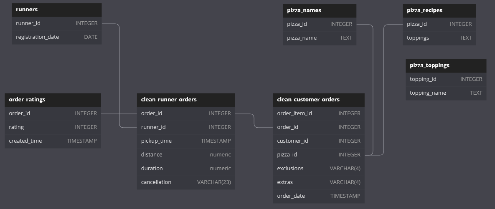

# Case Study 2-D: [Pizza Runner](https://8weeksqlchallenge.com/case-study-2/) - Pricing & Ratings

Pizza Runner would like to evaluate the impact of pricing on their bottom line, such as charging extra for additional toppings, and accounting for fees paid to runners for delivering this pizzas.

The company is also planning to let customers rate their orders after delivery and then store this information in the database for future analysis.

### ER Diagram 



*Diagram adapted from [case study webpage](https://8weeksqlchallenge.com/case-study-2/). An additional table for order ratings was created to answer the questions in this section.*

## Pizza Prices and Revenue

### Question 1
> If a Meat Lovers pizza costs $12 and Vegetarian costs $10 and there were no charges for changes - how much money has Pizza Runner made so far if there are no delivery fees?

- Exclude cancelled orders (we assume that the costs are refunded)
- Assign prices to each pizza based on the type of pizza order

|revenue_total|
|-------------|
|138|

```sql
SELECT
    sum(CASE
            WHEN pn.pizza_name = 'Meatlovers' THEN 12
            ELSE 10
        END) AS revenue_total
FROM clean_customer_orders AS co
INNER JOIN clean_runner_orders AS ro
    ON co.order_id = ro.order_id
INNER JOIN pizza_names AS pn
    ON co.pizza_id = pn.pizza_id
WHERE ro.pickup_time IS NOT NULL -- exclude cancelled orders; 
```

### Question 2
> What would be the total amount made so far if there was an additional $1 charge for each pizza extra?  

- Assume that every extra topping costs $1
- List extras for pizzas ordered and set their price to ($)1
- Tally the price of extras for each pizza
- Add the price of extras to the standard price for each pizza
- Exclude pizzas that were not delivered

|revenue_total|
|-------------|
|142|

<details>
<summary>Click to Show/Hide SQL query</summary>

```sql
-- list extras for pizzas ordered
WITH order_extras AS (
    SELECT 
        order_item_id,
        -- split pizzas with multiple extras into separate rows
        UNNEST(
            string_to_array(extras, ',')
        )::int AS extra_id -- cast as integer for joining
    FROM clean_customer_orders
),
-- assume that every extra topping costs $1
-- add up total price of extras per pizza
extras_price AS (
    SELECT
        ext.order_item_id,
        sum(1) AS extra_price
    FROM order_extras AS ext
    INNER JOIN pizza_toppings AS pt
        ON ext.extra_id = pt.topping_id
    GROUP BY ext.order_item_id
)
SELECT 
    sum(CASE -- price of standard pizza
            WHEN pn.pizza_name = 'Meatlovers' THEN 12
            ELSE 10
        END +
        CASE -- add price of extras (0 if none)
            WHEN extp.extra_price IS NULL THEN 0
            ELSE extp.extra_price
        END) AS total_price
FROM clean_customer_orders AS co
LEFT JOIN extras_price AS extp -- not all pizzas have extras
    ON co.order_item_id = extp.order_item_id
INNER JOIN clean_runner_orders AS ro
    ON co.order_id = ro.order_id
INNER JOIN pizza_names AS pn
    ON co.pizza_id = pn.pizza_id
WHERE ro.pickup_time IS NOT NULL; -- exclude cancelled orders
```

</details>

---
## Ratings
### Question 3
> The Pizza Runner team now wants to add an additional ratings system that allows customers to rate their runner, how would you design an additional table for this new dataset - generate a schema for this new table and insert your own data for ratings for each successful customer order between 1 to 5.

- Create `order_ratings` table
- Rating is given as an `integer` (primary key `order_id`), value between 1 to 5
- This table has a 1-1 relationship with the `runner_orders` table: one review for one order

```sql
DROP TABLE IF EXISTS order_ratings;
CREATE TABLE order_ratings (
  "order_id" INTEGER,
  "rating" INTEGER
);
INSERT INTO order_ratings
    ("order_id", "rating")
VALUES
    (1, 4),
    (2, 4),
    (3, 5),
    (4, 3),
    (5, 5),
    (6, 1),
    (7, 3),
    (8, 4),
    (9, 2),
    (10, 5)
```

### Question 4
> Using your newly generated table - can you join all of the information together to form a table which has the following information for successful deliveries?  
> - `customer_id`
> - `order_id`
> - `runner_id`
> - `rating`
> - `order_time`
> - `pickup_time`
> - Time between order and pickup
> - Delivery duration
> - Average speed
> - Total number of pizzas

- `customer_orders` are on a finer granularity (pizza) and needs to be rolled up to the order level
- filter only for successful deliveries

First 3 rows of the final table is shown below:

|customer_id|order_id|runner_id|rating|order_time|pickup_time|time_to_pickup|duration_mins|average_speed_km_min|num_pizzas|
|-----------|--------|---------|------|----------|-----------|--------------|-------------|--------------------|----------|
|101|1|1|4|2020-01-01 18:05:02.000|2020-01-01 18:15:34.000|00:10:32|32|0.62500000000000000000|1|
|101|2|1|4|2020-01-01 19:00:52.000|2020-01-01 19:10:54.000|00:10:02|27|0.74074074074074074074|1|
|102|3|1|5|2020-01-02 23:51:23.000|2020-01-03 00:12:37.000|00:21:14|20|0.67000000000000000000|2|

<details>
<summary><b>Click to Show/Hide SQL query</b></summary>

```sql
-- roll up customer orders to the order level
-- tally number of pizzas and get earliest order time (if they differ)
WITH order_summary AS (
    SELECT 
        order_id,
        customer_id,
        count(pizza_id) AS num_pizzas,
        min(order_time) AS order_time
    FROM clean_customer_orders
    GROUP BY order_id, customer_id
    ORDER BY order_id, customer_id
)
SELECT 
    os.customer_id,
    ro.order_id,
    ro.runner_id,
    ort.rating,
    os.order_time,
    ro.pickup_time,
    ro.pickup_time - os.order_time AS time_to_pickup,
    ro.duration_mins,
    ro.distance_km / ro.duration_mins AS average_speed_km_min,
    os.num_pizzas
FROM order_summary AS os
INNER JOIN clean_runner_orders AS ro
    ON os.order_id = ro.order_id
INNER JOIN order_ratings AS ort
    ON ro.order_id = ort.order_id
WHERE ro.pickup_time IS NOT NULL;
```

</details>

---
## Costs of Delivery 

### Question 5
> If a Meat Lovers pizza was $12 and Vegetarian $10 fixed prices with no cost for extras and each runner is paid $0.30 per kilometre traveled - how much money does Pizza Runner have left over after these deliveries?

- Only include delivered orders
- Tally total cost of pizzas per order
- Subtract fees paid to runners 

|total_profit|
|------------|
|94.44|

```sql
-- tally pizza sales for each delivered order
WITH order_sales AS (
    SELECT
        ro.order_id,
        sum(CASE
                WHEN pn.pizza_name = 'Meatlovers' THEN 12
                ELSE 10
            END) AS sales_total
    FROM clean_customer_orders AS co
    INNER JOIN clean_runner_orders AS ro
        ON co.order_id = ro.order_id
    INNER JOIN pizza_names AS pn
        ON co.pizza_id = pn.pizza_id
    WHERE ro.pickup_time IS NOT NULL
    GROUP BY ro.order_id
)
-- subtract fees paid to runners (based on distance) for each order
SELECT 
    sum(os.sales_total - (ro.distance_km * 0.3)) AS total_profit
FROM clean_runner_orders AS ro
INNER JOIN order_sales AS os
    ON ro.order_id = os.order_id;
```